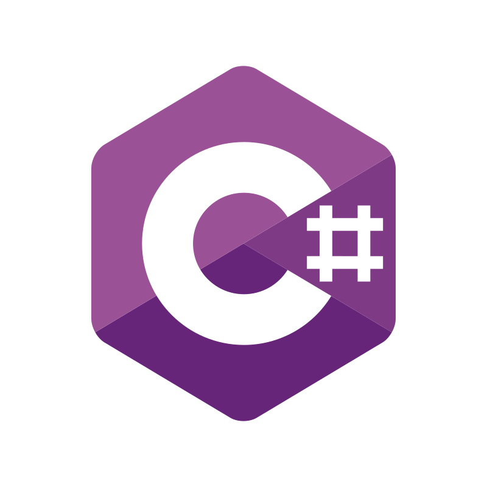
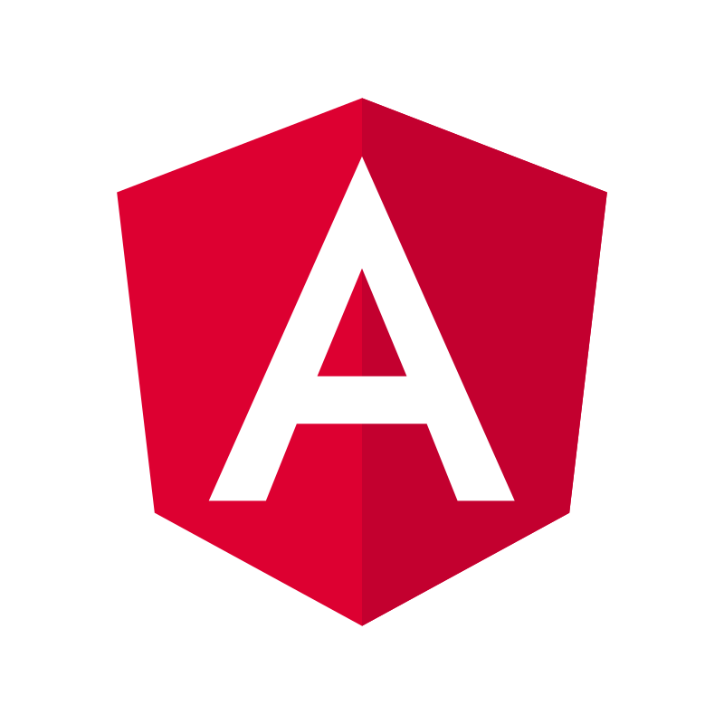
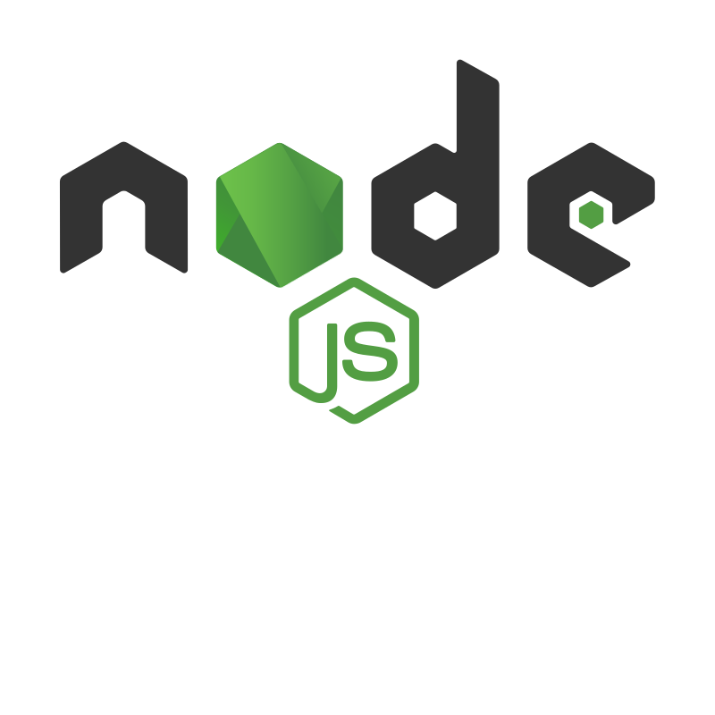
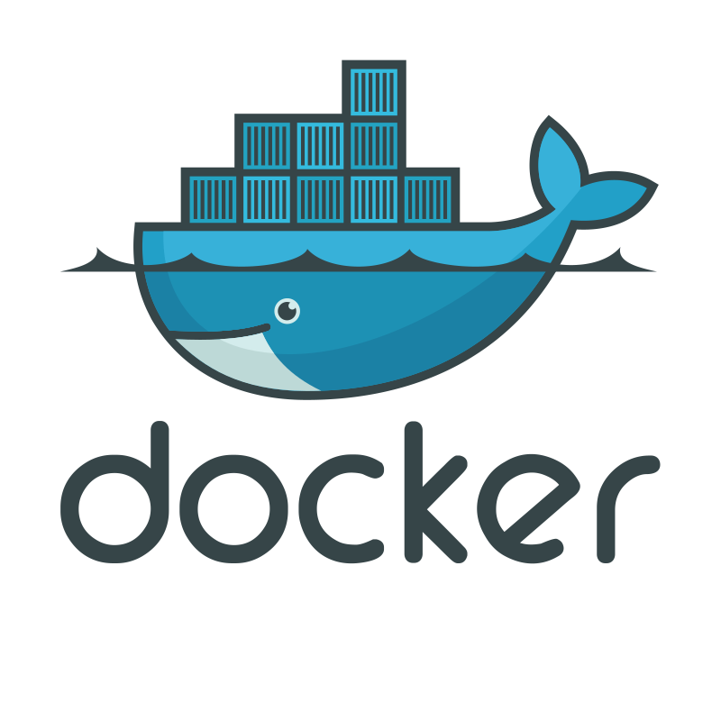
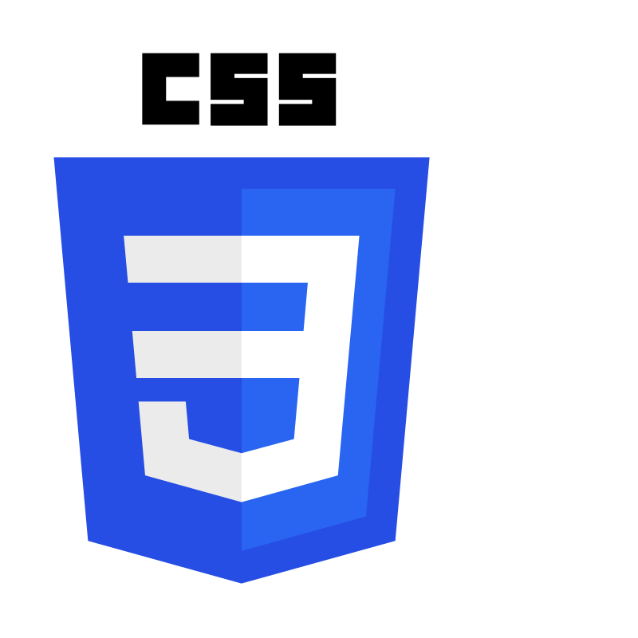
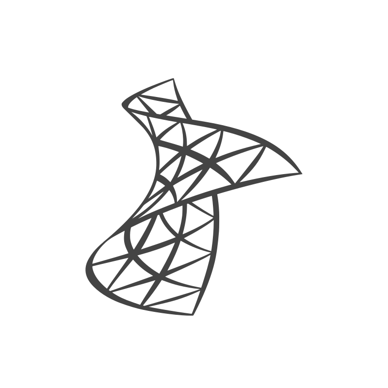
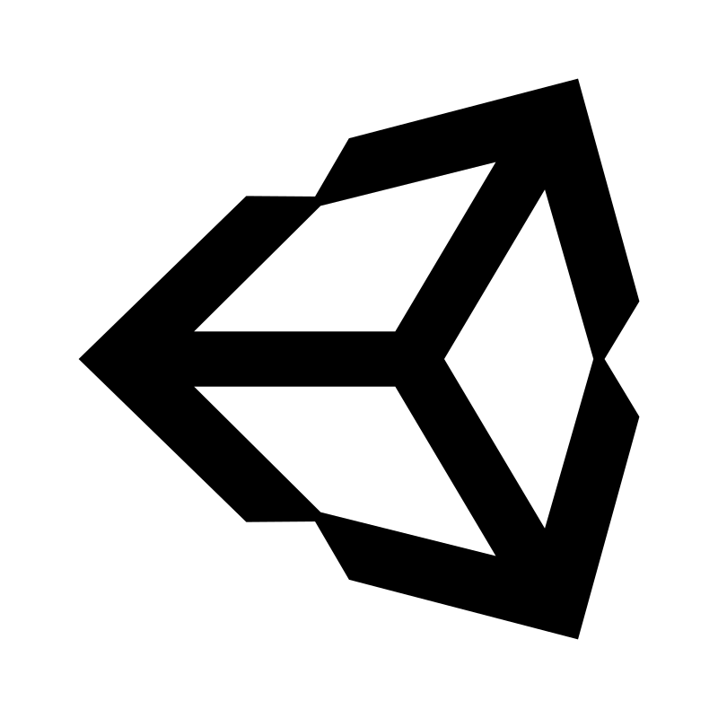
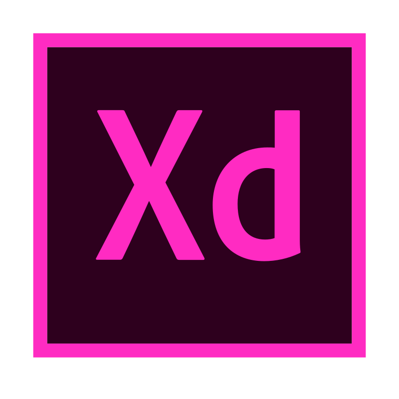

<h2>Hey 👋, I'm <a href="#">Eider</a></h2>

I'm a Full Stack software engineer with a master degree in computing with interest and experience with web development, using technologies like PHP, Laravel, C#, ASP.NET, Angular 2+, TypeScript, JQuery and SQL Relational Databases.

<h2>⚡️ A Few Quick Facts</h2>
<ul>
<li>🔭 I'm currently looking for a new remote job abroad.</li>
<li>🧐 Learning about <strong>Microfrontend</strong>, <strong>Reactive State Management</strong>, <strong>Node.js</strong> and all techs from the <strong>MEAN</strong> stack.</li>
<li>💬 Ping me about <strong>Angular 2+, PHP, ASP.NET/MVC and C#</strong>.</li>
<li>📙 Check out my <a href="https://docs.google.com/document/d/1gJ97rpp1FhcIj5kTwS02VVv2OBuSyvpE4uGOVC_RHhY/edit?usp=sharing">resume</a>.
</ul>
&nbsp;

## 🧰 Languages and Tools

&nbsp;

## 📊 Statistics

    

    

